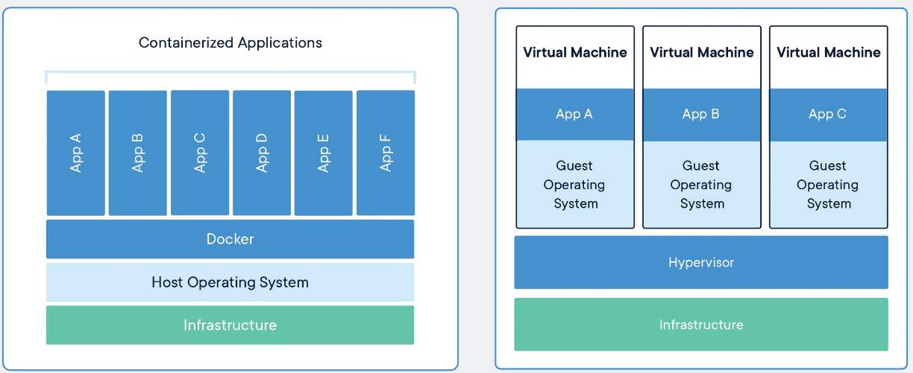

# Packaging up your controller into a container

[TOC]

[Back to tutorial contents](../README.md#contents)

## Containers

As you may have guessed, Starling heavily makes use of "docker containers" for the encapsulation and execution of our applications.

In fact, throughout these tutorials, we have constantly been referring to "application containers", "containers", "docker container" and so on. So far we have simply asked you to consider them as mini operating systems or virtual machines. But perhaps now is a good time to go into a little more detail.

### What is Containerisation and Docker

It would be nice to give a computer - any computer with an internet connection - a short string of ASCII characters (say via a keyboard), press enter, and return to see some program running. Forget about where the program was built or what software you happened to be running at the time (this can be checked, and we can fetch the necessary dependencies). Sounds simple, right? In fact, this is an engineering task that has taken thousands of the world’s brightest developers many decades to implement.

Thanks to the magic of container technology we now can run any Linux program on almost any networked device on the planet, as is. All of the environment preparation, installation and configuration steps can be automated from start to finish. Depending on how much network bandwidth you have, it might take a while, but that’s all right. All you need to do is type the string correctly.

Docker is one very widely used example of containerisation technology, and the one we make use of in Starling. They provide a large number of tools and programs to help us contain, develop, test and deploy our containers to the real world.

If you followed the [getting started](getting_started.md), you should hopefully have done the full docker install. If not, you can run the following command from a linux command line to install basic docker.

```
 curl -sSL https://get.docker.com/ | sh
```

### Docker Concepts in more detail

> Adapted from [Docker Resources](https://www.docker.com/resources/what-container/)

A **container** is a standard unit of software that packages up code and all its dependencies so the application runs quickly and reliably from one computing environment to another. A Docker container image is a lightweight, standalone, executable package of software that includes everything needed to run an application: code, runtime, system tools, system libraries and settings.

Container **images** become containers at runtime and in the case of Docker containers – images become containers when they run on Docker Engine. Available for both Linux and Windows-based applications, containerized software will always run the same, regardless of the infrastructure. Containers isolate software from its environment and ensure that it works uniformly despite differences for instance between development and staging.

Containers are *Standard* (can run anywhere), *Lightweight* (Share low level machine system and not the whole Operating System) and *Secure* (Each application is as isolated as possible). For us this also translates to providing *Reproduceable* and *Reusable* systems.



On the left, Containers are an abstraction at the app layer that packages code and dependencies together. Multiple containers can run on the same machine and share the OS kernel with other containers, each running as isolated processes in user space. Containers take up less space than VMs (container images are typically tens of MBs in size), can handle more applications and require fewer VMs and Operating systems.

On the right, Virtual machines (VMs) are an abstraction of physical hardware turning one server into many servers. The hypervisor allows multiple VMs to run on a single machine. Each VM includes a full copy of an operating system, the application, necessary binaries and libraries – taking up tens of GBs. VMs can also be slow to boot.

### Docker and Starling

Then to connect things back to Starling - The purpose of Starling is to allow you to quickly and easily install and run a UAV simulation within a simulated environment, so that you can test your developed controllers against a semi-realistic scenario, to then test in the real world

Therefore Starling is a set of pre-built programs/executables, some of which are pre-configured for the following:

- Running a Physics Simulation with Visualisation
- Running the Drone autopilot control software locally (a.k.a Software In The Loop or SITL)
- Running the interface between Mavlink and other protocols such as the Robot Operating System (ROS)
- And many others...

These pre-built containers are all available in the [StarlingUAS repository on github](https://github.com/StarlingUAS) and on Docker Hub.

## Packaging your controller

### Anatomy of a Docker Container

From the user's perspective, a Docker image / container is simply the operating system and essentials - such as installationas, application code, and dependencies. In Starling we create Docker images by using a **Dockerfile** - a plain text file that provides the specifications for creating a Docker image.

> See [this post](https://jfrog.com/knowledge-base/a-beginners-guide-to-understanding-and-building-docker-images/) for more details

In Starling, a controller Docker container is based on the following image template [`uobflightlabstarling/starling-controller-base:latest`](https://github.com/StarlingUAS/ProjectStarling/blob/master/system/controller-base/Dockerfile)

- It is based on the Ubuntu 20.04 distribution (focal)
- It has ROS2 FOXY installed in it
- It has `mavros_msgs` and a number of other related packages already installed
- There exists a folder in the root directory `/ros_ws` which will contain all user space code. This is the ROS2 workspace. Your application source goes into `/ros_ws/src`.

### Writing a Dockerfile

The **Dockerfile** which specifies your controller is at `fenswood_drone_controller/Dockerfile` and should look something like the following:

```Dockerfile
1.  FROM uobflightlabstarling/starling-controller-base:latest
2.
3.  RUN apt update
4.  RUN apt-get install -y ros-foxy-vision-opencv python3-pip
5.  RUN pip3 install opencv-python
6.
7.  COPY . /ros_ws/src/fenswood_drone_controller
8.
9.  RUN . /ros_ws/install/setup.sh \
     && colcon build
10.
11. CMD [ "ros2", "launch", "fenswood_drone_controller", "controller.launch.xml" ]
```

When you build a Dockerfile, Docker reads and executes the commands specified line by line. This is similar to when you have a blank linux distribution and start typing instructions to install libraries and applications. Breaking it down line by line:

```Dockerfile
1.  FROM uobflightlabstarling/starling-controller-base:latest
```

This line (the `FROM`) tells the builder the Docker image which we should build upon or augment. In this case we are building your application on top of the controller base image.

```Dockerfile
3.  RUN apt update
4.  RUN apt-get install -y ros-foxy-vision-opencv python3-pip
5.  RUN pip3 install opencv-python
```

Here we are installing the key libraries using `apt-get` and `pip3`, the package managers for ubuntu and python respectively. These libraries are not included in the base image, so we need to add them before your application can run. If you find you need any other dependencies, you will need to install them here.

The `RUN` command tells Docker to simply run the given command inside the container.

> Simply installing the dependencies on your local machine will do nothing inside the container.

```Dockerfile
7.  COPY . /ros_ws/src/fenswood_drone_controller
```

This `COPY` command then takes everything locally in the same directory as the Dockerfile (specified using dot `.`) and copies it into the container at the path given. This is a normal way of getting files from your local system into the container.

> *Note:* Copy will literally copy the state of all of your files at the time of building. Any new changes to your files will not be reflected in the container until your build again. However, there are ways to allow you to do live editing inside the container - see [bind mounts](https://docs.docker.com/storage/bind-mounts/) - we will need these if you want to get data out.

```Dockerfile
9.  RUN . /ros_ws/install/setup.sh \
     && colcon build
```

This line then compiles your ros nodes. The first command `. /ros_ws/install/setup.sh` *sources* ROS2. That means it makes the ROS2 command line commands available for the terminal to use. The second command `colcon build`. Then builds all of the ros nodes it can find in the `src` directory. This is the step which builds your container.

> *Note:* All `RUN` commands are run inside the `/ros_ws` folder. This was specified in the parent image. So `colcon build` is run inside `/ros_ws` and therefore looks for ros packages inside `/ros_ws/src`

```Dockerfile
11. CMD [ "ros2", "launch", "fenswood_drone_controller", "controller.launch.xml" ]
```

Finally, the `CMD` specifies the command that the Docker image will run when run. Here, by default, the docker contaienr will launch the `controller.launch.xml` launch file from within `fenswood_drone_controller`

> *Note:* This command is run inside the container using the bash shell. There is a hidden file called `/ros_entrypoint.sh` which is sourced just before running the command. This entrypoint file sources ros and the `/ros_ws` workspace so bash knows about your local ros nodes.

> *Note:* this CMD can and often is over-ridden. See any of the docker-compose files where we run one of the other controllers.

### Building a Docker container

Now we have the Dockerfile, the only thing left to do is build it. There are 2 ways:

1. Using the Docker command line tool from the root of this repository. This will create a new docker image called `my_application` which you can then run.

        docker build -t my_application fenswood_drone_controller
        docker run my_application


2. Using Docker-Compose, which is how we've been doing it for the majority of this tutorial. In the docker-compose.yml we specify the relative path to the Dockerfile and docker-compose will build the application for us.

        controller:
            build: ../fenswood_drone_controller

> *Note:* There is a 3rd method which uses `docker buildx` which you might see in some of the other Starling projects. This is needed in order to build containers for other computer architectures - such as for the raspberry pi which runs on an Arm64 chip (aka cross-platform). We may cover this at a later date.

> *Note:* The build process uses caching to speed up. The Dockerfile commands are run in order so if an earlier command has not changed, or it detects no changes, it will only rebuild the new stuff.
>
## Exercises

1. Add a new dependency into your code (e.g. use the scipy library for something small). Try and add it to your Dockerfile and rebuild.
2. Change the `CMD` line to run a different controller launch file by default.

[Back to tutorial contents](../README.md#contents)
