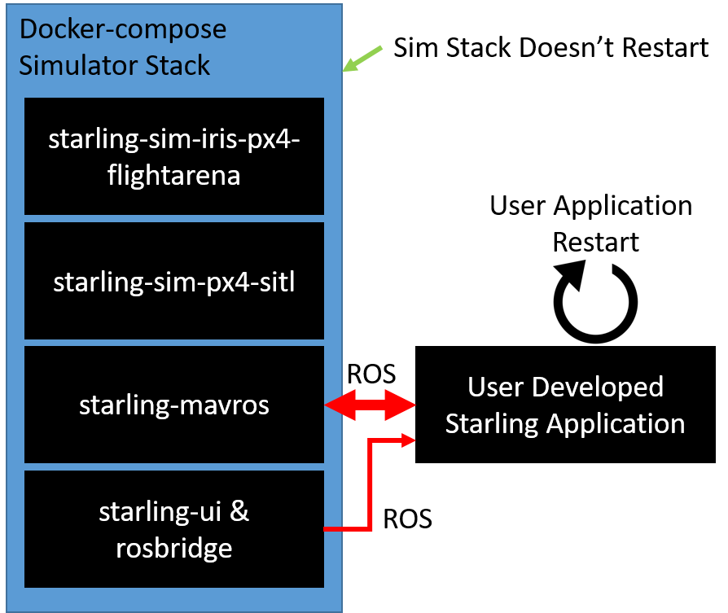

# Local Testing and Development workflows

[TOC]

[Back to tutorial contents](../README.md#contents)

## More efficent local development and testing

### Splitting the simulator and the controller

So far, you have been running the controller using `docker-compose` with the `--build` command which both builds your controller and starts up the entire simulator stack. You may start to notice that this can sometimes take really long - in particular the simulator start up can sometimes be annoyingly inconsistant.

Therefore Starling introduces a new paradigm which allows you to *attach and detach a sidecar* application container to your simulation.

> (This example is from PX4, but the same applies for Ardupilot!)



Essentially we start the simulator stack on its own in one termianl. Then with the instructions from [the previous tutorial](containers.md) we can create a standalone application container which we can build, restart and test without needing to restart the entire simulator!

> *Note:* If the drone crashes or the autopilot becomes unresponsive, you will still need to restart your simulator. However this method should reduce the number of simulator restarts required.

### Sidecar in practice

To run the simulator only, you can use the docker-compose file in `8_containers`. Therefore in one terminal, run the following.

```bash
docker-compose -f 8_containers/docker-compose.yml up
```

Then *start a new terminal*. Note that when you run docker-compose, it will start a new mini Docker network in which it communicates over. We first need to find the name of this network so that we when we run our application, ROS2 can find the simulator.

```bash
$ docker network ls

NETWORK ID     NAME                                                DRIVER    SCOPE
04468b7ccad2   1_old_school_default                                bridge    local
1282aac186af   7_multi_part_default                                bridge    local
472239bc901c   8_containers_default                                bridge    local <---
546d35750dc0   bridge                                              bridge    local
681c73eec26a   deployment_default                                  bridge    local
...
```

Running the above we identify that `8_containers_default` is the name of the network.

> *Note:* In general the network name is the `<parent directory of docker-compose file>_default`.

We then build and run our container, remembering to specify our network.

```bash
docker build -t my_application:latest fenswood_drone_controller
docker run -it --rm --net=8_containers_default my_application:latest
```

This will hopefully start your application, and it will hopefully connect to the simulator. Then if you make any changes, you just need to rebuild and rerun your application and it will automatically reconnect via ROS.

### Makefiles

The final element to be introduced is the **Makefile**. A **Makefile** is a simple tool which we like using to streamline the number of commands we have to manually enter. An example makefile can be found in `8_containers/Makefile`

```makefile
MAKEFILE_DIR:=$(shell dirname $(realpath $(firstword $(MAKEFILE_LIST))))
DOCKERFILE:=$(MAKEFILE_DIR)/../fenswood_drone_controller

IMAGE_NAME?=fenswood_drone_controller
NETWORK?=8_containers_default
ENV?=
RUN_ARGS?=

all: build

help:
	@echo "all - run build"
	@echo "build - build the dockerfile for this project"
	@echo "run - builds and runs the dockerfile for this project"
	@echo "run_bash - builds and runs the dockerfile putting you into a bash shell"
	@echo "help - show this help screen"

build:
	docker build -t $(IMAGE_NAME) $(DOCKERFILE)

run: build
	docker run -it --rm --net=$(NETWORK) $(ENV) -e USE_SIMULATED_TIME=true $(RUN_ARGS) $(IMAGE_NAME)

run_bash: build
	docker run -it --rm --net=$(NETWORK) $(ENV) -e USE_SIMULATED_TIME=true $(RUN_ARGS) $(IMAGE_NAME) bash

.PHONY: all help build run run_bash
```

Then breaking this down, this Makefile defines 5 commands which can be run: `all`, `help`, `build`, `run` and `run_bash`. These can each be run from inside the 8_containers directory using the `make <command>` command. For example

```bash
make # By default just make will run the first command in the file
make run # This will run the `run` command
```

```makefile
MAKEFILE_DIR:=$(shell dirname $(realpath $(firstword $(MAKEFILE_LIST))))
DOCKERFILE:=$(MAKEFILE_DIR)/../fenswood_drone_controller

IMAGE_NAME?=fenswood_drone_controller
NETWORK?=8_containers_default
ENV?=
RUN_ARGS?=
```

These lines define useful variables which are used within the Makefile. These can be changed to whatever suits. The `:=` equality defines variables which cannot be changed. The `?=` defines variables which can be changed at run time. For example you could change network at runtime by running:

        make run NETWORK=someothernetwork_default

```
run: build
	docker run -it --rm --net=$(NETWORK) $(ENV) -e USE_SIMULATED_TIME=true $(RUN_ARGS) $(IMAGE_NAME)
```

Singling out the `run` command, there are a number of features. First after the colon, we specify the `build` command. This represents a dependency of `run` on `build`. Therefore the `build` command is always run before the `run` command.

The command is then defined on the second line. This can literally be any bash command. Here we specify the running of the image we build. See how it uses all of the variables we defined at the top of the file.

```
.PHONY: all help build run run_bash
```

This final line just tells `make` that theses are valid makefile commands, and not folders or anything else of the same name.

Then in the context of Starling, instead of manually running the `docker build` and `docker run` commands, I like the simplicity of just running `make run` to rebuild and run my application container.

## Exercises

1. Try and run your application in *sidecar* mode. Make a change to your source and try and re-run your controller without restarting the simulator.
2. Write a simple Makefile for you to use
3. Add an extra command to the makefile called `simulator` which runs the command needed to start the simulation stack

[Back to tutorial contents](../README.md#contents)