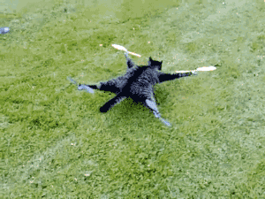

# Conclusion and Next Steps

**Congratulations!** You have finished the fenswood volcano tutorial on writing your own MAVLINK and ROS2 compatible controller.

Hopefully now you have learnt and understood how Mavlink is used to communicate to the drone and how to use ROS to control the drone with Mavlink. You should have also seen a number of different ways of organising your code in a more modular fashion to allow greater flexibitiliy and reliability in your implementations. Finally we showed how you might add Perception through the use of OpenCV in order to autonomously control your drone if you so wish!

At this point, you should have enough knowledge to be able to create a controller which can solve the task in a simple way.

However, you have probably noticed that there's probably a lot more going on under the surface. So for those wanting to do some more complex tasks, you may be interested in learning a bit more about the underlying simulation. For you, I would recommend carrying on to the Advanced Tutorial.

The advanced tutorial will more formally introduce you to the Starling simulation system that you have been using and how your ROS controller fits into it.

Either way, thank you for going through this tutorial and good luck going forward!

Authors:

- Mickey Li (2022) (mickey.li@bristol.ac.uk)
- Arthur Richards (2021) (arthur.richards@bristol.ac.uk)